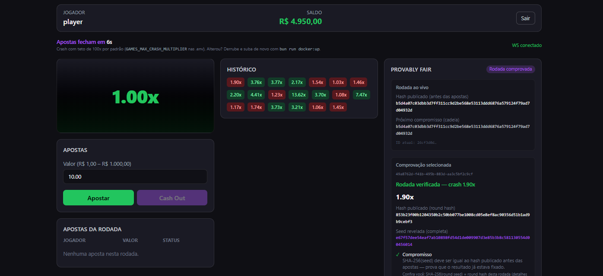

# Crash Game — Real-Time Multiplayer Platform



<table>
<tr>
<td width="50%" valign="top">

### Português

**Crash Game** é um jogo multiplayer em tempo real no estilo iGaming: o multiplicador sobe a partir de 1,00x e pode parar a qualquer instante. Quem apostou precisa **sacar antes do crash** para ganhar; quem não sacou perde a aposta.

Este repositório é um **produto completo, desenvolvido do zero por mim**: crash multiplayer em tempo real com motor próprio, carteira desacoplada, login seguro (OIDC), provably fair e sincronização ao vivo. Foi estruturado a partir de um **brief de produto** no universo iGaming — **trabalho autoral e independente**, não mockup, fork ou CRUD de demonstração.

**Por que isso importa no mundo real**

- **Dinheiro preciso** — valores em centavos inteiros, sem erros de arredondamento típicos de sistemas financeiros mal modelados.
- **Transparência** — cada rodada pode ser auditada pelo jogador (provably fair / hash chain).
- **Multiplayer real** — vários clientes veem o mesmo multiplicador e as mesmas apostas, ao mesmo tempo.
- **Separação jogo × carteira** — padrão de iGaming e fintech: o saldo não fica acoplado ao motor da rodada.
- **Pronto para demo local** — sobe com um comando Docker, sem configuração manual.

**Destaques**

- Login OIDC (Keycloak) e carteira com saldo inicial
- Apostas, cash out e feedback de ganho/perda em tempo real
- Painel de fairness com verificação das últimas rodadas
- Testes automatizados (domínio, broker, E2E de gameplay)

</td>
<td width="50%" valign="top">

### English

**Crash Game** is a real-time multiplayer game in the iGaming style: the multiplier rises from 1.00x and can crash at any moment. Players must **cash out before the crash** to win; otherwise they lose the bet.

This repository is a **complete product, built from scratch by me**: real-time multiplayer crash with a custom round engine, decoupled wallet, secure OIDC login, provably fair rounds, and live sync. It was shaped from a **product brief** in the iGaming space — **independent, original work**, not a mockup, fork, or demo CRUD.

**Why it matters in the real world**

- **Precise money handling** — integer cents, avoiding floating-point rounding issues common in poorly modeled financial systems.
- **Transparency** — each round can be audited by the player (provably fair / hash chain).
- **True multiplayer** — multiple clients see the same multiplier and bets in sync.
- **Game vs wallet separation** — standard iGaming/fintech pattern; balance is not tied to the round engine.
- **Demo-ready locally** — starts with one Docker command, no manual setup.

**Highlights**

- OIDC login (Keycloak) and wallet with initial balance
- Bets, cash out, and win/loss feedback in real time
- Fairness panel with verification of past rounds
- Automated tests (domain, broker, gameplay E2E)

</td>
</tr>
</table>

_Built as a full-stack take-home challenge; maintained as a portfolio piece._

---

## Try it in 2 minutes · Experimente em 2 minutos

**PT:** `bun install` → `bun run docker:up` → abra [http://localhost:3000](http://localhost:3000) → login **`player`** / **`player123`** (saldo inicial R$ 5.000).

**EN:** Same steps. On first boot, wait **~1–2 min** for images and Keycloak; the UI shows _Starting application…_ until backends are ready.

```bash
bun install
bun run docker:up        # Full stack: infra + services + frontend
```

```bash
bun run docker:down      # Stop containers (keeps Postgres volume)
bun run docker:prune     # Full reset (volumes + images)
bun run dev:frontend     # Local Vite :3000 (backends via Docker)
```

### Demo access

| Item            | Value                                                                  |
| --------------- | ---------------------------------------------------------------------- |
| Login           | `player` / `player123`                                                 |
| Frontend        | [http://localhost:3000](http://localhost:3000)                         |
| API (Kong)      | [http://localhost:8000](http://localhost:8000)                         |
| WebSocket       | [http://localhost:4001/games](http://localhost:4001/games) (Socket.IO) |
| Keycloak        | [http://localhost:8080](http://localhost:8080) — realm `crash-game`    |
| Initial balance | R$ 5,000 (`WALLETS_INITIAL_BALANCE_CENTS=500000`)                      |

OIDC (authorization code + PKCE) → `POST /wallets` creates the wallet on first login.

---

## For developers and CTOs

**PT:** Arquitetura distribuída, contratos REST/WebSocket, provably fair com hash chain, testes e trade-offs estão abaixo.

**EN:** Distributed architecture, REST/WebSocket contracts, provably fair hash chain, tests, and trade-offs are documented below.

- [Stack](#stack)
- [Architecture](#architecture)
- [REST API](#rest-api)
- [WebSocket](#websocket)
- [Provably Fair](#provably-fair)
- [Money precision](#money-precision)
- [Smoke checks](#smoke-checks)
- [Tests](#tests)
- [Implemented capabilities](#implemented-capabilities)
- [Extra highlights](#extra-highlights)
- [Trade-offs and limitations](#trade-offs-and-limitations)
- [About this project](#about-this-project)

---

## Stack

| Layer     | Technology                   |
| --------- | ---------------------------- |
| Runtime   | Bun 1.3                      |
| Backend   | NestJS 11, TypeScript strict |
| Database  | PostgreSQL 18                |
| Messaging | RabbitMQ                     |
| Gateway   | Kong                         |
| Auth      | Keycloak (OIDC / JWT)        |
| Real-time | Socket.IO                    |
| Frontend  | React 19, Vite, Tailwind     |

Shared contracts: `packages/shared` (`@crash/shared`).

---

## Architecture

```text
                    Browser (:3000)
              REST (Kong)  |  WebSocket (direct)
                    v      v
              Kong :8000    Game Service :4001
           /games    /wallets      |
              |          |         +-- Round engine, PF, WS
              v          v
         Game Service  Wallet Service
              |          |
              +---- RabbitMQ (crash.events) ----+
              |          |                      |
              v          v                      |
         PostgreSQL  PostgreSQL                |
              (games)   (wallets)              |
                                               |
         Keycloak :8080 -- JWT on private endpoints
```

- **Player actions** (bet, cash out): REST via Kong.
- **Live updates** (multiplier, bets, fairness): WebSocket on Game Service (`:4001/games`).

---

## REST API

Base URL: `http://localhost:8000`

### Wallet — `/wallets`

| Method | Endpoint      | Auth | Description                            |
| ------ | ------------- | ---- | -------------------------------------- |
| `POST` | `/wallets`    | Yes  | Create wallet for authenticated player |
| `GET`  | `/wallets/me` | Yes  | Balance and wallet data                |

Credit/debit are **not** exposed via REST — they flow through RabbitMQ.

### Game — `/games`

| Method | Endpoint                        | Auth | Description                                |
| ------ | ------------------------------- | ---- | ------------------------------------------ |
| `GET`  | `/games/health`                 | No   | Health check                               |
| `GET`  | `/games/rounds/current`         | No   | Current round (`committedRoundHash`, bets) |
| `GET`  | `/games/rounds/history`         | No   | Paginated round history                    |
| `GET`  | `/games/rounds/:roundId/verify` | No   | Provably fair verification                 |
| `GET`  | `/games/bets/me`                | Yes  | Player bet history                         |
| `POST` | `/games/bet`                    | Yes  | Place bet on current round                 |
| `POST` | `/games/bet/cashout`            | Yes  | Cash out at current multiplier             |

---

## WebSocket

Connection: `http://localhost:4001/games` · Socket.IO namespace `/games`.

Server → client only; player actions use REST.

| Event                   | Main fields                                                         | Seed revealed? |
| ----------------------- | ------------------------------------------------------------------- | -------------- |
| `round:snapshot`        | `roundId`, `committedRoundHash`, `nextRoundHash`, `bets`, `history` | No             |
| `round:betting-started` | `roundId`, `committedRoundHash`                                     | No             |
| `round:started`         | `roundId`, `currentMultiplier`                                      | No             |
| `round:tick`            | `roundId`, `currentMultiplier`                                      | No             |
| `round:crashed`         | `roundId`, `crashPoint`                                             | No             |
| `round:settled`         | `roundId`, `revealedRoundSeed`, `nextRoundHash`, `crashPoint`       | **Yes**        |
| `round:history-updated` | `items[]` (`roundId`, `crashPoint`, `committedRoundHash`)           | No             |
| `bet:placed`            | `betId`, `roundId`, `playerId`, `amountCents`, `status`             | No             |
| `bet:cashout`           | `betId`, `multiplier`, `payoutCents`, `status`                      | No             |
| `bet:removed`           | `betId`, `roundId`, `playerId`                                      | No             |

Typed payloads: `packages/shared/src/websocket/`.

---

## Provably Fair

Algorithm: `algorithmVersion: "v1-chain"` · implementation: `services/games/src/domain/provably-fair/`.

### Commit (before the round)

| Public                                      | Secret (server)        |
| ------------------------------------------- | ---------------------- |
| `committedRoundHash` = SHA-256(`roundSeed`) | `roundSeed` from chain |

Exposed via `round:betting-started`, `round:snapshot`, `GET /games/rounds/current`, and the fairness UI panel. The seed **never** leaks before crash (covered by E2E `websocket-realtime.spec.ts`).

### Reveal (after crash)

Exposed in `round:settled` and `GET /games/rounds/:roundId/verify`:

- `revealedRoundSeed`, `crashPoint`, `nextRoundHash`
- `previousRoundHash`, `nonce`, `clientSeed` (optional)

### Crash point calculation

```
HMAC-SHA256(roundSeed, "${clientSeed}:${nonce}") → 13 hex → Bustabit-style formula
```

- ~**3%** instant crashes at **1.00x** (`h % 33 === 0` — house edge).
- Configurable cap: `GAMES_MAX_CRASH_MULTIPLIER` (default **100x**).

### Hash chain (anti-tampering)

1. Pre-generated `SeedChain` (10,000 seeds) persisted in `chain_state`.
2. Round _i_: publishes `roundHash`; after crash reveals `roundSeed` and `nextRoundHash = SHA-256(seed[i+1])`.
3. Audit: `nextRoundHash` of round _i_ must equal `committedRoundHash` of round _i+1_ (`chainValid` in `/verify`).

**MVP limitation:** pre-generated chain at startup — changing a past seed invalidates the whole chain; not ad-hoc per-round commit–reveal.

### How to verify a round

1. During betting, note `committedRoundHash` (fairness panel or WebSocket).
2. After crash:

```bash
 curl -s http://localhost:8000/games/rounds/{roundId}/verify | jq .
```

3. Expect: `"valid": true`, `"crashValid": true`, `"chainValid": true`.
4. UI: fairness panel auto-verifies recent rounds; _How to verify yourself_ dropdown explains SHA-256 + HMAC steps.
5. Local recalculation: `verifyRound` and `computeCrashPoint` in `services/games/src/domain/provably-fair/`.

---

## Money precision

- All amounts in **integer cents** (`amountCents` as string in JSON; `bigint` in domain).
- No floating point for money.
- Wallet balance never goes negative (domain invariant).

Bet limits: R$ 1.00 – R$ 1,000.00 per round · one bet per player per round.

---

## Smoke checks

```bash
curl -sf http://localhost:8000/games/health && echo " games OK"
curl -sf http://localhost:8000/wallets/health && echo " wallets OK"
curl -s http://localhost:8000/games/rounds/current | jq '.committedRoundHash'

TOKEN=$(curl -s -X POST "http://localhost:8080/realms/crash-game/protocol/openid-connect/token" \
  -H "Content-Type: application/x-www-form-urlencoded" \
  -d "grant_type=password" -d "client_id=crash-game-client" \
  -d "username=player" -d "password=player123" | jq -r .access_token)
curl -s -H "Authorization: Bearer $TOKEN" http://localhost:8000/wallets/me | jq .
```

After a settled round, replace `{roundId}` in `/games/rounds/{roundId}/verify`.

---

## Tests

Domain unit tests, broker integration, and gameplay E2E (bet, cashout, crash, JWT, WebSocket sync).

```bash
bun run test:unit
bun run test:e2e                 # requires docker:up
bun run test:required:report     # unit + E2E + infra manifest
```

Local dev env files: copy from `frontend/.env.example`, `services/games/.env.example`, `services/wallets/.env.example`.

---

## Implemented capabilities

- [x] One-command Docker startup (`bun run docker:up`) — Keycloak realm, Kong, migrations
- [x] Full gameplay: bet → multiplier → cash out / crash → settlement via broker
- [x] Separate Game and Wallet services over RabbitMQ
- [x] Real-time sync across clients (same hash and ticks)
- [x] Integer-cent money; non-negative balance
- [x] Keycloak JWT on private endpoints
- [x] Game engine: rounds, bets, crash, provably fair, WebSocket
- [x] Wallet: credit/debit via events, protected REST
- [x] Frontend: OIDC login, chart, bets, cash out, history, balance
- [x] Verifiable provably fair (`/verify` + UI + hash chain)
- [x] Hash published before round; seed revealed only after crash
- [x] Automated unit and E2E tests

---

## Extra highlights

- Fairness panel with last 10 rounds and self-verify guide
- Startup screen during Docker cold start
- `test:required:report` with infra manifest
- Three-column layout (game | history | fairness), toasts, live win/loss feedback

---

## Trade-offs and limitations

| Topic           | Decision                                                              |
| --------------- | --------------------------------------------------------------------- |
| Actions vs push | REST for actions; WebSocket server→client only                        |
| Consistency     | RabbitMQ saga + idempotency by `eventId`; no outbox                   |
| Provably fair   | Pre-generated `SeedChain` (MVP); chaining via `nextRoundHash`         |
| Crash cap       | `GAMES_MAX_CRASH_MULTIPLIER` default 100x                             |
| Cold start      | ~1–2 min on first boot; UI waits for health checks                    |
| Persistence     | `pg` + manual SQL; Prisma not implemented                             |
| WebSocket       | Direct `:4001`; Kong upgrade not validated as primary                 |
| Betting window  | Default 7s (`GAMES_BETTING_DURATION_MS` / `VITE_BETTING_DURATION_MS`) |

**Reset state:** `docker compose down` keeps Postgres. Use `bun run docker:prune` or `docker compose down -v` for a clean slate.

---

## About this project

|            |                                                                                                                                                                                             |
| ---------- | ------------------------------------------------------------------------------------------------------------------------------------------------------------------------------------------- |
| **PT**     | Projeto full-stack inspirado em desafio técnico de iGaming (crash game). Hoje funciona como **portfolio**: arquitetura distribuída, UX de produto e auditoria de fairness.                  |
| **EN**     | Full-stack project inspired by an iGaming-style technical challenge (crash game). Now maintained as a **portfolio** piece: distributed architecture, product UX, and fairness auditability. |
| **Author** | [Diêgo Ferreira](https://github.com/dbfcode)                                                                                                                                                |

**Code references:** `services/games/src/domain/provably-fair/` · `packages/shared/`
